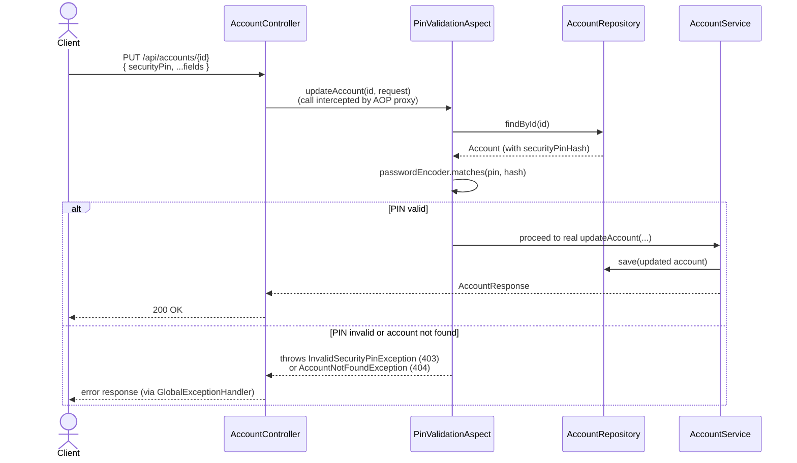

# Rogers Account Management API

CRUD API for a customer Account Management service, keyed by email (one account per email).
On create/update, country + postal code are enriched via https://api.zippopotam.us to resolve
Place, State, Longitude and Latitude.

## Run

```
docker compose up -d   # starts Redis on localhost:6379
mvnw spring-boot:run
```

Starts on `http://localhost:8080`.

- **Swagger UI**: http://localhost:8080/swagger-ui.html
- **OpenAPI JSON**: http://localhost:8080/v3/api-docs
- **Actuator**: http://localhost:8080/actuator (health/info/metrics)

Redis caches postal code lookups (`ZippopotamClient`, see below) — it's optional, not a hard
dependency: if it's unreachable, lookups just skip the cache and call zippopotam.us directly every
time.

## API

| Method | Path                                           | Purpose                     | PIN needed?        |
|--------|------------------------------------------------|------------------------------|---------------------|
| POST   | `/api/accounts`                                 | Create account               | No                  |
| GET    | `/api/accounts?accountId=...` or `?email=...`   | Retrieve one account          | No                  |
| GET    | `/api/accounts/counts?country=US`               | Account counts by State → Place | No               |
| PUT    | `/api/accounts/{accountId}`                     | Update an Active account      | **Yes (in body)**  |
| DELETE | `/api/accounts/{accountId}`                     | Delete an Inactive account    | **Yes (in body)**  |
| PATCH  | `/api/accounts/{accountId}/status`              | Change account status         | **Yes (in body)**  |

```
curl -X POST localhost:8080/api/accounts -H 'Content-Type: application/json' -d '{
  "name": "Alice", "email": "alice@example.com", "country": "US", "postalCode": "35203", "age": 30
}'
# -> {"accountId":"Y547PL","status":"ACTIVE","securityPin":"9348"}

curl -X PUT localhost:8080/api/accounts/Y547PL \
  -H 'Content-Type: application/json' -d '{"age": 31, "securityPin": "9348"}'
# -> 200 (updated account)
```

## API contract & codegen

[`openapi.yaml`](src/main/resources/openapi.yaml) is the source of truth for
the API contract:
- `AccountsApi` — the Spring MVC interface for `AccountController`
- `dto.*` — request/response models with Bean Validation annotations.

## Security PIN validation

The PIN is hashed with BCrypt at creation (`Account.securityPinHash`) and returned in plaintext
only once, in the create response. `PUT`, `DELETE`, and `PATCH .../status` take `securityPin` as a
plain field in the request body — there's no separate verify-pin endpoint on this branch.



**Known trade-offs of this approach:**
- No brute-force lockout — a caller can retry all 10,000 PIN combinations directly.
- The PIN is retransmitted on every mutating call rather than verified once per session.
- AOP only fires through a real Spring-proxied bean — tests that mock/new-up AccountService
  directly bypass it, so PIN logic is unit-tested separately.

**Logging is masked at two independent layers:**
1. `PinValidationAspect` logs `providedPin=****`/`<missing>` rather than the raw value.
2. Logback registers a Logback converter that masks `securityPin`/`providedPin`/`name`/`age` wherever they appear in any rendered log
   line. But `DemoDataSeeder` intentionally prints demo PINs in plain at startup for our reference.

## Assumptions made on requirements

1. **When does an account become Inactive?** Only when the user explicitly updates it to Inactive.
2. **Is there a PIN reset option?** Not implemented — if the PIN is lost (e.g. after multiple failed
   attempts), there's no recovery flow. Future scope for a production-ready version.
3. **Does retrieve-counts include non-Active accounts?** Yes — assumed it should fetch accounts of
   all statuses, not just Active.
4. **Does updating status/fields need the security PIN?** Yes, for additional safety — applied the
   same way regardless of the specific transition (Active→Inactive, Inactive→Active, Requested).
5. **Should the bonus status-update API require the security PIN?** Assumed yes, as a self-serve
   action. In the future, this could instead be an admin action using an admin-owned key/PIN.
6. **Soft delete or hard delete?** Proceeded with hard delete.
