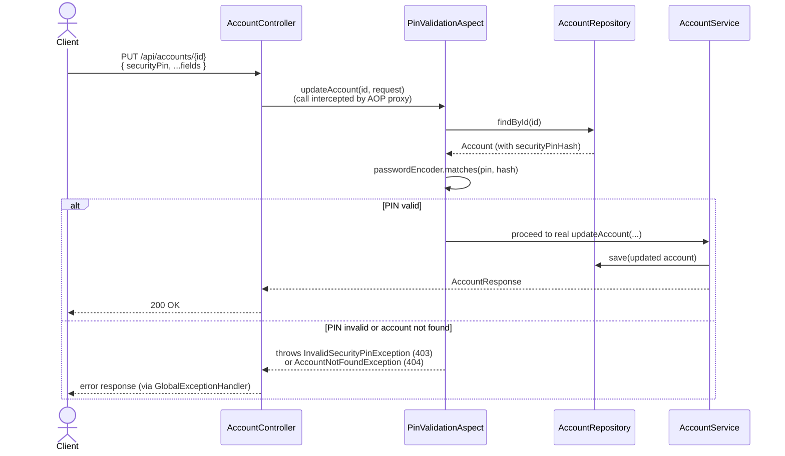

# Rogers Account Management API

CRUD API for a customer Account Management service, keyed by email (one account per email).
On create/update, country + postal code are enriched via https://api.zippopotam.us to resolve
Place, State, Longitude and Latitude.

> **Branch note:** `feature/aspect-pin` enforces the security PIN via Spring AOP
> (`PinValidationAspect`) with the PIN sent directly in the request body — a deliberately simpler
> alternative to `feature/pin-verification-token-flow`'s verify-once token exchange. See
> [Security PIN validation](#security-pin-validation) below.

## Run

```
./mvnw spring-boot:run
```

Starts on `http://localhost:8080`. `DemoDataSeeder` creates ~9 sample accounts on startup (account
ids/PINs are printed in the log) so every endpoint has data to try immediately.

## Test

```
./mvnw test
```

76 unit tests: business rules (`AccountServiceTest`), repository behavior
(`AccountRepositoryTest`), ID generation (`IdGeneratorTest`), the postal lookup client
(`ZippopotamClientTest`), error mapping (`GlobalExceptionHandlerTest`), PIN validation logic
(`PinValidationAspectTest`), and HTTP-layer wiring (`AccountControllerTest`).

## API

| Method | Path                                           | Purpose                     | PIN needed?        |
|--------|------------------------------------------------|------------------------------|---------------------|
| POST   | `/api/accounts`                                 | Create account               | No                  |
| GET    | `/api/accounts?accountId=...` or `?email=...`   | Retrieve one account          | No                  |
| GET    | `/api/accounts/counts?country=US`               | Account counts by State → Place | No               |
| PUT    | `/api/accounts/{accountId}`                     | Update an Active account      | **Yes (in body)**  |
| DELETE | `/api/accounts/{accountId}`                     | Delete an Inactive account    | **Yes (in body)**  |
| PATCH  | `/api/accounts/{accountId}/status`              | Change account status         | **Yes (in body)**  |

```
curl -X POST localhost:8080/api/accounts -H 'Content-Type: application/json' -d '{
  "name": "Alice", "email": "alice@example.com", "country": "US", "postalCode": "35203", "age": 30
}'
# -> {"accountId":"Y547PL","status":"ACTIVE","securityPin":"9348"}

curl -X PUT localhost:8080/api/accounts/Y547PL \
  -H 'Content-Type: application/json' -d '{"age": 31, "securityPin": "9348"}'
# -> 200 (updated account)
```

## Security PIN validation

The PIN is hashed with BCrypt at creation (`Account.securityPinHash`) and returned in plaintext
only once, in the create response. `PUT`, `DELETE`, and `PATCH .../status` take `securityPin` as a
plain field in the request body — there's no separate verify-pin endpoint on this branch.



`PinValidationAspect` is a `@Before` advice on `@ValidatePin`-annotated `AccountService` methods.
Since the three protected methods take different DTOs, it pulls the PIN via reflection
(`getSecurityPin()`) rather than a typed pointcut per method.

**Trade-offs vs. the token-flow branch** (deliberate, for comparison):
- No brute-force lockout — a caller can retry all 10,000 PIN combinations directly.
- The PIN is retransmitted on every mutating call instead of exchanged once for a short-lived token.
- AOP only fires through a real Spring-proxied bean — tests that mock/new-up `AccountService`
  directly bypass it, so PIN logic is unit-tested separately (`PinValidationAspectTest`).

**Logging is masked at two independent layers:**
1. `PinValidationAspect` logs `providedPin=****`/`<missing>` rather than the raw value.
2. `logback-spring.xml` registers a Logback converter (`SensitiveDataMaskingConverter`, `%mask`)
   that masks `securityPin`/`providedPin`/`name`/`age` wherever they appear in any rendered log
   line, as a backstop — e.g. if a DTO's `toString()` were ever logged whole. It deliberately
   excludes bare `pin`, since `DemoDataSeeder` intentionally prints demo PINs in plain at startup.

## Package layout

Organized by technical layer:

| Package | Contents |
|---|---|
| `controller` | `AccountController` (implements the generated `AccountsApi`) |
| `service` | `AccountService` (business rules), `ZippopotamClient` |
| `repository` | `AccountRepository` (in-memory store) |
| `model` | `Account`, `AccountStatus`, `Location` (internal, distinct from `dto`) |
| `dto` | Generated request/response models (see below) |
| `util` | `IdGenerator` |
| `config` | `RestClientConfig`, `DemoDataSeeder`, `SecurityConfig` |
| `security` | `ValidatePin`, `PinValidationAspect` |
| `logging` | `SensitiveDataMaskingConverter` |
| `exception` | `ApiException` hierarchy, `Constants`, `GlobalExceptionHandler` |

## API contract & codegen

[`src/main/resources/openapi.yaml`](src/main/resources/openapi.yaml) is the source of truth for
the API contract. `openapi-generator-maven-plugin` generates (into
`target/generated-sources/openapi`, not checked in):
- `AccountsApi` — the Spring MVC interface `AccountController` implements, with all
  `@RequestMapping`/`@Valid` annotations derived from the spec.
- `dto.*` — request/response models with Jakarta Bean Validation annotations.

Regenerate with `./mvnw generate-sources` after editing `openapi.yaml`.

## Assumptions

- **Storage**: in-memory (`ConcurrentHashMap`), per the assignment — data doesn't survive a restart.
- **Account ID**: 6-character alphanumeric, randomly generated, checked for uniqueness.
- **Security PIN**: 4-digit numeric, generated at creation, shown only once. Checked on `PUT`,
  `DELETE`, and status-change — the spec only requires it for `DELETE`; extending it to the other
  two mutating endpoints keeps the rule consistent.
- **Create status**: `status` may be omitted or `"Requested"`; anything else is rejected (400). The
  persisted account is always created `ACTIVE`, per spec.
- **Name**: alphanumeric only, 1–20 characters, mandatory.
- **Country**: restricted to `US`, `DE`, `ES`, `FR` (case-insensitive input, stored uppercase).
- **Postal code**: exactly 5 digits, mandatory on create.
- **Update (`PUT`)**: only while `ACTIVE`. Zippopotam lookup re-runs only if country/postal code
  actually changed.
- **Delete (`DELETE`)**: only while `INACTIVE`.
- **Retrieve one**: `accountId` or `email`; `accountId` takes precedence if both given.
- **Retrieve counts**: all accounts matching the given country, grouped and sorted alphabetically.
- **Status-change endpoint**: can set any of `REQUESTED`/`ACTIVE`/`INACTIVE` directly, without the
  "must be Active" restriction `PUT` has.
- **Swagger/codegen**: `openapi.yaml` is hand-authored (no compatible `springdoc-openapi` release
  for Spring Boot 4 / Spring Framework 7 was available). Enums use top-level named schemas, since
  `openapi-generator`'s inline enums silently fall back to `null` on bad values instead of 400.
- **Error format**: consistent JSON body (`{timestamp, status, error, message, fieldErrors}`) via a
  global `@RestControllerAdvice`; unhandled errors return a generic message, with the real
  exception logged server-side only.
